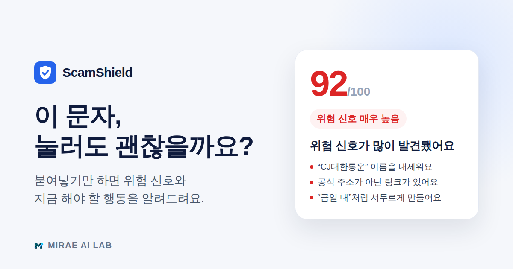

# ScamShield — 사기문자·스미싱 위험도 검사

의심스러운 문자를 붙여넣으면 **위험 신호와 지금 해야 할 행동**을 몇 초 안에 알려주는 모바일 우선 웹앱입니다.
가입 없이 바로 쓰고, 기록은 이 기기에만 남습니다. (기획·제작: 미래AI랩)



> 분석 결과는 참고용 위험 신호 안내이며, 실제 사기 여부를 확정하는 판정이 아닙니다.

## 핵심 흐름

```
홈(입력) ─ 붙여넣기 버튼 · 샘플 칩 · 캡처 이미지(데모 OCR → 확인·수정)
   │  위험도 검사하기 (Ctrl/⌘ + Enter)
   ▼
/result/:id ─ 결론(점수·등급) → 이유 2~3개 → 지금 해야 할 행동
   │           ├ (접힘) 이미 링크를 눌렀거나 돈을 보냈다면? → 112·1332·118 바로 전화
   │           ├ 의심되는 문구 하이라이트 → 눌러서 이유 보기
   │           └ (접힘) 자세한 분석: 위험 신호 · 링크/연락처
   ▼
가족에게 공유 → 분석 기록(날짜별)에 "공유함" 표시 → 다시 보기 / 삭제
```

- 결과는 고유 주소를 가져 **새로고침·뒤로가기·딥링크**에서도 유지됩니다.
- 같은 문자를 다시 검사하면 기록을 새로 쌓지 않고 기존 기록을 교체합니다.
- 입력 중인 문자는 다른 화면을 다녀와도 유지되고(탭 단위), 2,000자를 넘게 붙여넣으면 앞부분만 넣고 알려줍니다.

## 기술 스택

Next.js 15 (App Router) · React 19 · TypeScript (strict) · Tailwind CSS v4 · lucide-react · Vitest

런타임 의존성은 `next`, `react`, `react-dom`, `lucide-react` 네 개뿐입니다.

## 구조

```
app/
  page.tsx                 홈 — 입력 폼, 최근 검사, 자주 오는 사기 유형
  result/[id]/page.tsx     결과 (데스크톱 2열: 판정 고정 패널 + 행동·근거)
  history · guide · my · about
  api/analyze/route.ts     분석 API — 본문 크기·형식 검증 후 엔진 호출
  error.tsx · global-error.tsx · not-found.tsx
  manifest.ts · robots.ts · sitemap.ts · opengraph-image.png
components/                화면 단위 컴포넌트 (ResultView, AnalyzeForm, …)
lib/
  risk-engine.ts           규칙 기반 분석 엔진 (순수 함수, 결정적)
  verdict.ts               결과 표현 규칙 — 판정 문구·이유·행동 분리
  storage.ts               기록 저장소 (localStorage + 메모리 폴백)
  validation.ts            API 요청 검증
  ai.ts                    클라이언트 진입점 — API 호출, 실패 시 로컬 엔진 폴백
tests/                     단위 테스트 (엔진·표현·저장소·검증·API·날짜 표기)
```

`/analyze`, `/history/:id`는 이전 주소 호환용 리다이렉트입니다.

## 분석 엔진 (`lib/risk-engine.ts`)

입력 문자에서 6가지 신호를 찾아 점수를 더하는 **설명 가능한 규칙 엔진**입니다. 같은 입력은 항상 같은 결과를 냅니다.

| 신호 | 기본 가중치 | 예시 |
| --- | --- | --- |
| 외부 링크 | 25 | URL, 단축 URL |
| 개인정보·인증 요구 | 25 | 인증번호, 본인 인증, 카드번호, 주소 확인 |
| 긴급 행동 유도 | 20 | 즉시, 금일 내, 정지 예정, 반송·보관 중 |
| 금전 요구·유인 | 20 | 송금, 상품권·핀번호, 해외 승인, 햇살론 |
| 기관 사칭 | 15 | 은행·카드사, 경찰·검찰, 택배사 |
| 심리적 접근 | 12 | 가족 호칭, 휴대폰 고장·임시폰, 당첨 |

- 같은 신호의 추가 문구는 개당 +3 (최대 +9)
- 링크 위험: 단축 URL +5, 스미싱에 흔한 도메인(.top, .xyz …) +12, 내용과 공식 도메인 불일치 +8
- **함께 나오면 더 위험한 조합**: 가족·지인 + 금전 +12 · 기관 + 금전 +8 · 기관·금전 안내를 개인 휴대폰 번호로 +15
- 등급: 30 주의 · 60 높음 · 80 매우 높음. 100점은 "사기 확정"처럼 보여 **상한을 96점**으로 두었고, 신호가 없으면 12점을 넘지 않습니다.
- 오탐 방지: "이체가 완료되었습니다", "급여가 입금되었습니다" 같은 알림은 금전 요구로 보지 않습니다.

엔진 결과는 저장되고, 화면 문구는 `lib/verdict.ts`가 매번 다시 만듭니다. 그래서 문구를 다듬어도 과거 기록에 같은 기준이 적용됩니다.

## 저장소 (`lib/storage.ts`)

- `localStorage`에 최대 50건, 키에 스키마 버전을 붙여(`scamshield.history.v2`) 형식이 바뀌어도 충돌하지 않게 했습니다.
- 손상된 항목·깨진 JSON은 건너뛰어 화면이 깨지지 않습니다.
- 사생활 보호 모드처럼 저장소를 못 쓰면 메모리 폴백으로 방금 검사한 결과는 계속 볼 수 있습니다.
- 첫 방문에만 예시 기록 8건을 채우고, 사용자가 한 번이라도 저장·삭제하면 다시 채우지 않습니다.

## 품질 관리

| 항목 | 방법 |
| --- | --- |
| 단위 테스트 | `npm test` — 엔진 회귀(샘플·실제와 비슷한 문자 오탐/미탐), 표현 규칙, 저장소, 요청 검증, API, 날짜 표기 |
| CI | `.github/workflows/ci.yml` — typecheck → lint → test → build |
| 접근성 | axe-core 점검 위반 0건(모바일·데스크톱 전 화면), 본문 바로가기, 모든 조작 요소 포커스 표시, 보조 텍스트 대비 4.5:1 이상 |
| 레이아웃 안정성 | 불러오는 동안 스켈레톤이 화면 높이를 미리 차지해 CLS ≈ 0 |
| API | Content-Type·본문 크기(16KB)·형식·길이 검증, `Cache-Control: no-store` |
| 보안 헤더 | `X-Content-Type-Options`, `Referrer-Policy`, `Permissions-Policy`, `X-Powered-By` 제거 |
| 의존성 | 운영 의존성 `npm audit` 취약점 0건 |

## 접근성·사용성

- 글자 크기 3단계(보통 / 크게 112.5% / 아주 크게 125%) — 첫 페인트 전에 적용해 화면이 튀지 않습니다.
- 역할 기반 타입 스케일: 본문 17px 기준, 고령 사용자를 고려해 표준보다 한 단계 크게.
- `prefers-reduced-motion`을 존중하고, 안내 문구의 말투는 해요체로 통일했습니다(면책 문구 제외).

## 데모 범위

| 기능 | 현재 |
| --- | --- |
| 위험도 분석 | 규칙 기반 데모 엔진 (서버 API, 실패 시 브라우저에서 같은 엔진 실행) |
| 캡처 이미지 인식 | 데모 OCR — 예시 문장을 채우고 사용자가 확인·수정 |
| LLM 분석 | 연결 지점만 준비 (`app/api/analyze/route.ts`) |
| 저장 | 브라우저 localStorage (서버 저장 설계안: `supabase/schema.sql`) |

## 미래AI랩 브릿지 CTA

- 컴포넌트: `components/SampleBridgeCTA.tsx` (모든 페이지 하단)
- 링크·문구: `lib/mirae.ts`의 `MIRAE_LINKS`, `MIRAE_COPY`

## 개발

```bash
npm install
npm run dev        # http://localhost:3000
npm run check      # typecheck + lint + test
npm run build
```

환경변수는 `.env.example` 참고. 값이 없어도 완전히 동작합니다.
